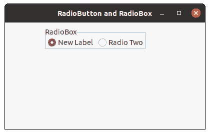

# wx 中的 wxPython–setitem label()方法。无线电盒

> 原文:[https://www . geesforgeks . org/wxpython-setitem label-method-in-wx-radio box/](https://www.geeksforgeeks.org/wxpython-setitemlabel-method-in-wx-radiobox/)

在本文中，我们将学习与 wx 相关的`SetItemLabel()`方法。wxPython 的 RadioBox 类。SetItemLabel()方法只是用来设置单选框中第 n 项的文本。

它以我们要更改其标签的项目的索引和新标签字符串为参数。

> **语法:** wx。RadioBox.SetItemLabel(self，n，text)
> 
> **参数**
> 
> | 参数 | 输入类型 | 描述 |
> | --- | --- | --- |
> | n | （同 Internationalorganizations）国际组织 | 从零开始的项索引。 |
> | 文本 | 线 | 为项目标签设置的文本 |

**代码示例:**

```py
import wx

class FrameUI(wx.Frame):

    def __init__(self, parent, title):
        super(FrameUI, self).__init__(parent, title = title, size =(300, 200))

        # function for in-frame components
        self.InitUI()

    def InitUI(self):
        # parent panel for radio box
        pnl = wx.Panel(self)

        # list of choices
        lblList = ['Radio One', 'Radio Two']

        # create radio box containing above list
        self.rbox = wx.RadioBox(pnl, label ='RadioBox', pos =(80, 10), choices = lblList,
                                           majorDimension = 1, style = wx.RA_SPECIFY_ROWS)

        # set new label for item at 0
        self.rbox.SetItemLabel(0, "New Label")

        # set frame in centre
        self.Centre()
        # set size of frame
        self.SetSize((400, 250))
        # show output frame
        self.Show(True)

# wx App instance
ex = wx.App()
# Example instance
FrameUI(None, 'RadioButton and RadioBox')
ex.MainLoop()
```

**输出窗口:**
