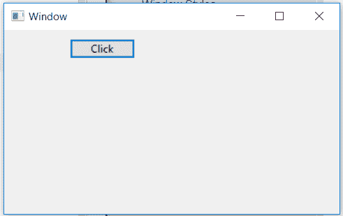
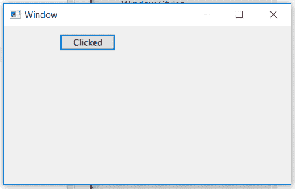

# wx xpython–wx 中的 SetLabel()函数。按钮

> 原文:[https://www . geesforgeks . org/wxpython-set label-function-in-wx-button/](https://www.geeksforgeeks.org/wxpython-setlabel-function-in-wx-button/)

在本文中，我们将学习与 wx 相关联的 SetLabel()函数。wxPython 的按钮类。SetLabel()函数用于设置按钮的字符串标签。

它采用一个字符串参数作为按钮的标签。

> **语法:** wx。按钮。设置标签(自身，标签)
> 
> **参数:**
> 
> | 参数 | 输入类型 | 描述 |
> | --- | --- | --- |
> | 标签 | 线 | 要设置的标签。 |

**代码示例:**

```py
import wx

class Mywin(wx.Frame):

    def __init__(self, parent, title):
        super(Mywin, self).__init__(parent, title = title, size =(250, 150))
        self.InitUI()

    def InitUI(self):
        self.panel = wx.Panel(self)
        self.btn = wx.Button(self.panel, label ="Click", pos =(75, 10))
        self.btn.Bind(wx.EVT_BUTTON, self.Onclick)

        self.SetMinSize((400, 250))
        self.Centre()
        self.Show(True)

    def Onclick(self, event):
        # SET A STRING LABEL FOR BUTTON
        self.btn.SetLabel("Clicked")

ex = wx.App()
Mywin(None, 'Window')
ex.MainLoop()
```

**输出窗口:**

*点击按钮*前


*后点击按钮*