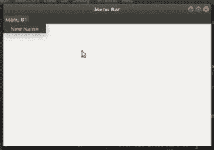

# wx xpython–wx 中的 SetLabel()函数。菜单栏

> 原文:[https://www . geesforgeks . org/wxpython-set label-function-in-wx-menu bar/](https://www.geeksforgeeks.org/wxpython-setlabel-function-in-wx-menubar/)

wx 中的另一个重要功能。菜单栏是 wx 中的 SetLabel()函数。wxPython 的菜单栏类。SetLabel()函数用于改变菜单栏中菜单项的标签(标题)。它仅在菜单栏与框架关联后使用。

> **语法:**
> 
> ```py
> wx.MenuBar(self, id, label)
> 
> ```
> 
> **参数:**
> 
> | 参数 | 输入类型 | 描述 |
> | --- | --- | --- |
> | 身份证明（identification） | （同 Internationalorganizations）国际组织 | “项目标识符”菜单。 |
> | 标签 | 线 | “项目标签”菜单。 |

**代码示例:**

```py
import wx

class Example(wx.Frame):
        super(w).__init__(*args, **kwargs)

        # create MenuBar using MenuBar() function
        menubar = wx.MenuBar()

        # add menu to MenuBar
        fm1 = wx.Menu()
        fileitem = fm1.Append(20, "Item # 1")
        menubar.Append(fm1, '&Menu # 1')
        self.SetMenuBar(menubar)
        self.SetSize((300, 200))
        self.SetTitle('Menu Bar')  

        # change label of menu item to New Name
        menubar.SetLabel(20, "New Name")

def main():

    app = wx.App()
    ex = Example(None)
    ex.Show()
    app.MainLoop()

if __name__ == '__main__':
    main()
```

**输出:**
