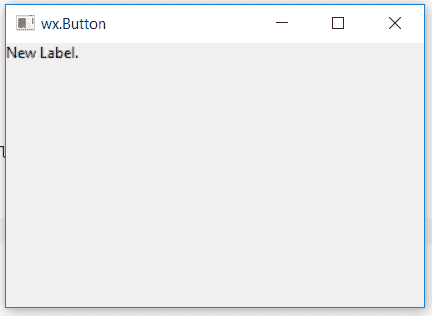

# wx xpython–wx 中的 SetLabel()函数。StaticText

> 原文:[https://www . geesforgeks . org/wxpython-set label-function-in-wx-static text/](https://www.geeksforgeeks.org/wxpython-setlabel-function-in-wx-statictext/)

在本文中，我们将学习与 wx 相关联的 SetLabel()函数。wxPython 的 StaticText 类。函数用于设置静态文本的字符串标签。

它采用一个字符串参数作为静态文本的标签。

> **语法:** wx。设置标签(自身，标签)
> 
> **参数:**
> 
> | 参数 | 输入类型 | 描述 |
> | --- | --- | --- |
> | 标签 | 线 | 要设置的标签。 |

**代码示例:**

## 蟒蛇 3

```
import wx

class Example(wx.Frame):

    def __init__(self, *args, **kwargs):
        super(Example, self).__init__(*args, **kwargs)
        self.InitUI()

    def InitUI(self):
        self.locale = wx.Locale(wx.LANGUAGE_ENGLISH)
        self.pnl = wx.Panel(self)

        bmp = wx.Bitmap('right.png')
        # CREATE STATICTEXT AT POINT (20, 20)
        self.st = wx.StaticText(self.pnl, id = 1, label ="Old Label.", pos =(0, 0),
                                size = wx.DefaultSize, style = 0, name ="statictext")

        # NEW LABEL
        self.st.SetLabel("New Label.")

        self.SetSize((350, 250))
        self.SetTitle('wx.Button')
        self.Centre()

def main():
    app = wx.App()
    ex = Example(None)
    ex.Show()
    app.MainLoop()

if __name__ == '__main__':
    main()
```

**输出窗口:**
