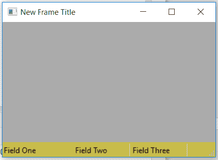

# wx Tyson–wx 中的 SetStatusStyles()函数。状态栏

> 原文:[https://www . geesforgeks . org/wxpython-setstatustyles-function-in-wx-status bar/](https://www.geeksforgeeks.org/wxpython-setstatusstyles-function-in-wx-statusbar/)

在本文中，我们将学习与 wx 相关的 SetStatusStyles()函数。wxPython 的 StatusBar 类。SetStatusStyles()函数设置状态行中字段的样式，这可以使字段显示为平面或凸起，而不是标准的凹陷 3D 边框。
取 n 个整数的数组，每个字段的样式作为参数。

> **语法:** wx。status bar . setstatustyles(Self，styles)
> **参数:**
> 
> <figure class="table">
> 
> | 参数 | 输入类型 | 描述 |
> | --- | --- | --- |
> | 风格 | int 列表 | 包含 n 个整数的数组，每个字段都有相应的样式。 |
> 
> </figure>
> 
> 有四种可能的样式:
> 1。SB_NORMAL(默认):该字段以默认本机边框显示。
> 2。SB_FLAT:没有在字段周围绘制边框，因此它看起来是平的。
> 3。SB_RAISED:在字段周围绘制一个凸起的 3D 边框。
> 4。SB _ dependent:在字段周围绘制了一个凹陷的 3D 边框(这种样式是自 wxWidgets 2.9.5 以来的新样式)。

**代码示例:**

## 蟒蛇 3

```
import wx

class Example(wx.Frame):

    def __init__(self, *args, **kwargs):
        super(Example, self).__init__(*args, **kwargs)

        self.InitUI()

    def InitUI(self):

        self.locale = wx.Locale(wx.LANGUAGE_ENGLISH)
        self.statusbar = wx.StatusBar()
        self.statusbar.Create(self, id = 1, name = "Status Bar")
        self.SetStatusBar(self.statusbar)
        self.SetSize((350, 250))

        # SET TOTAL NUMBER OF FIELDS AND RESPECTIVE WIDTHS
        self.statusbar.SetFieldsCount(3, [100, 80, 60])

        # SET TEXT FOR ALL FIELDS
        self.statusbar.SetStatusText("Field One", 0)
        self.statusbar.SetStatusText("Field Two", 1)
        self.statusbar.SetStatusText("Field Three", 2)
        self.statusbar.SetBackgroundColour((200, 188, 73, 243))

        # SET STYLES FOR ALL STATUS FIELDS
        self.statusbar.SetStatusStyles([wx.SB_FLAT, wx.SB_SUNKEN, wx.SB_RAISED])
        self.SetTitle('New Frame Title')
        self.Centre()
        print(self.statusbar.GetMinHeight())

def main():
    app = wx.App()
    ex = Example(None)
    ex.Show()
    app.MainLoop()

if __name__ == '__main__':
    main()
```

**输出窗口:**

