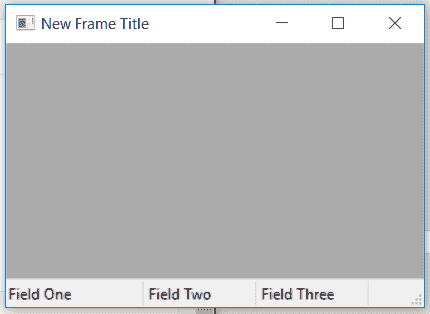

# wx Tyson–wx 中的 SetStatusText()函数。状态栏

> 原文:[https://www . geesforgeks . org/wxpython-setstatustext-function-in-wx-status bar/](https://www.geeksforgeeks.org/wxpython-setstatustext-function-in-wx-statusbar/)

在本文中，我们将了解与 wx 相关联的 SetStatusText()函数。wxPython 的 StatuBar 类。SetStatusText()函数只是用来设置第 I 个字段的状态文本。
给定文本将替换当前文本。状态栏的显示会立即更新，所以不需要调用 wx。窗口。调用此函数后更新。

> **语法：** wx.StatusBar.SetStatusText（self， text， i=0）
> 
> **参数:**
> 
> | 参数 | 输入类型 | 描述 |
> | --- | --- | --- |
> | 文本 | 线 | 要设置的文本。使用空字符串("")清除该字段。 |
> | 我 | （同 Internationalorganizations）国际组织 | 要设置的字段，从零开始。 |

**代码示例:**

```
import wx

class Example(wx.Frame):

    def __init__(self, *args, **kwargs):
        super(Example, self).__init__(*args, **kwargs)

        self.InitUI()

    def InitUI(self):

        self.locale = wx.Locale(wx.LANGUAGE_ENGLISH)
        self.statusbar = wx.StatusBar()
        self.statusbar.Create(self, id = 1, name = "Status Bar")
        self.SetStatusBar(self.statusbar)
        self.SetSize((350, 250))

        # SET TOTAL NUMBER OF FIELDS AND RESPECTIVE WIDTHS
        self.statusbar.SetFieldsCount(3, [100, 80, 60])

        # SET TEXT FOR ALL FIELDS
        self.statusbar.SetStatusText("Field One", 0)
        self.statusbar.SetStatusText("Field Two", 1)
        self.statusbar.SetStatusText("Field Three", 2)

        self.SetTitle('New Frame Title')
        self.Centre()
        print(self.statusbar.GetMinHeight())

def main():
    app = wx.App()
    ex = Example(None)
    ex.Show()
    app.MainLoop()

if __name__ == '__main__':
    main()
```

**输出窗口:**
