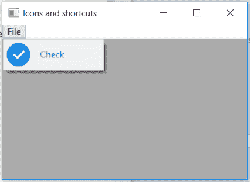

# wx 中的 wxPython–setTextcolor()函数。菜单项

> 原文:[https://www . geeksforgeeks . org/wxpython-setextcolor-function-in-wx-menuitem/](https://www.geeksforgeeks.org/wxpython-settextcolour-function-in-wx-menuitem/)

在本文中，我们将了解与 wx 相关联的 SetTextColour()函数。wxPython 的 MenuItem 类。SetTextColour()函数用于简单地设置与菜单项相关的文本颜色。
SetTextCoour()函数中只需要一个颜色参数。

> **语法:**
> 
> wx(地名)。menuitem . gettextcolour(自我)
> 
> **参数:**
> 
> | 参数 | 输入类型 | 描述 |
> | --- | --- | --- |
> | 颜色 | wx。颜色 | 菜单项文本的颜色。 |

**代码示例:**

```py
import wx

class Example(wx.Frame):

    def __init__(self, *args, **kwargs):
        super(Example, self).__init__(*args, **kwargs)

        self.InitUI()

    def InitUI(self):
        self.locale = wx.Locale(wx.LANGUAGE_ENGLISH)
        self.menubar = wx.MenuBar()
        self.fileMenu = wx.Menu()

        self.item = wx.MenuItem(self.fileMenu, 1, '&Check', 
                                  helpString ="Check Help")

        self.item.SetBitmap(wx.Bitmap('right.png'))

        # SET BLUE COLOUR FOR TEXT FORMAT(R, B, G, A)
        self.item.SetTextColour((79, 81, 230, 255))
        self.fileMenu.Append(self.item)
        self.menubar.Append(self.fileMenu, '&File')
        self.SetMenuBar(self.menubar)
        self.SetSize((350, 250))
        self.SetTitle('Icons and shortcuts')
        self.Centre()

def main():
    app = wx.App()
    ex = Example(None)
    ex.Show()
    app.MainLoop()

if __name__ == '__main__':
    main()
```

**输出:**
