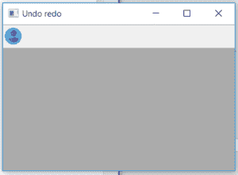
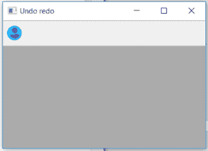
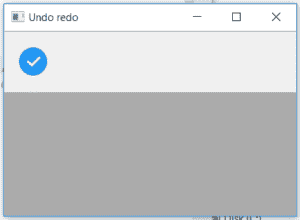

# wxPython–wx 中的 SetToolBitmapSize()函数。工具栏

> 原文:[https://www . geesforgeks . org/wxpython-settoolbitmapsize-function-in-wx-toolbar/](https://www.geeksforgeeks.org/wxpython-settoolbitmapsize-function-in-wx-toolbar/)

在本文中，我们将了解与 wx 相关联的 SetToolBitMapSize()函数。wxPythpon 的 ToolBar 类。设置每个工具位图的默认大小。默认位图大小为 16 乘 15 像素。它只接受大小作为参数。

> **语法:**
> 
> ```py
> wx.ToolBar.SetToolBitmapSize(self, size)
> 
> ```
> 
> **参数:**
> 
> | 参数 | 输入类型 | 描述 |
> | --- | --- | --- |
> | 大小 | wx。大小 | 工具栏中位图的大小.. |

**代码示例 1:**

```py
import wx

class Example(wx.Frame):

    def __init__(self, *args, **kwargs):
        super(Example, self).__init__(*args, **kwargs)
        self.InitUI()

    def InitUI(self):
        self.locale = wx.Locale(wx.LANGUAGE_ENGLISH)
        self.toolbar = self.CreateToolBar()

        td = self.toolbar.AddTool(1, 'right', wx.Bitmap('user.png'))
        self.toolbar.Realize()
        self.Bind(wx.EVT_TOOL, self.OnOne, td)

        self.SetSize((350, 250))
        self.SetTitle('Undo redo')
        self.Centre()

    def OnOne(self, e):
        # set bitmap size in toolbar
        self.toolbar.SetToolBitmapSize(size =(32, 32))
        # Realize() called to finalize new added tools
        self.toolbar.Realize()

    def OnQuit(self, e):
        self.Close()

def main():

    app = wx.App()
    ex = Example(None)
    ex.Show()
    app.MainLoop()

if __name__ == '__main__':
    main()
```

**输出:**
*点击前:*


*点击后:*


**代码示例 2:**

```py
import wx

class Example(wx.Frame):

    def __init__(self, *args, **kwargs):
        super(Example, self).__init__(*args, **kwargs)
        self.InitUI()

    def InitUI(self):
        self.locale = wx.Locale(wx.LANGUAGE_ENGLISH)
        self.toolbar = self.CreateToolBar()

        td = self.toolbar.AddTool(1, 'right', wx.Bitmap('right.png'))
        self.toolbar.Realize()
        self.Bind(wx.EVT_TOOL, self.OnOne, td)

        self.SetSize((350, 250))
        self.SetTitle('Undo redo')
        self.Centre()

    def OnOne(self, e):
        # set bitmap size in toolbar
        self.toolbar.SetToolBitmapSize(size =(60, 60))
        # Realize() called to finalize new added tools
        self.toolbar.Realize()

    def OnQuit(self, e):
        self.Close()

def main():

    app = wx.App()
    ex = Example(None)
    ex.Show()
    app.MainLoop()

if __name__ == '__main__':
    main()
```

**输出:**
*点击前:*


*点击后:*
