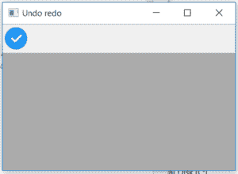

# wxPython–wx 中的 SetToolDisabledBitmap()函数。工具栏

> 原文:[https://www . geesforgeks . org/wxpython-settooldisablebitmap-function-in-wx-toolbar/](https://www.geeksforgeeks.org/wxpython-settooldisabledbitmap-function-in-wx-toolbar/)

在本文中，我们将学习与 wx 相关联的 SetToolDisabledBitmap 位图()函数。wxPython 的工具栏类。函数的作用是:当工具处于禁用状态时，用给定的 ID 设置工具要使用的位图。这只能在按钮工具上使用，不能在控件上使用。它需要两个参数 id 和位图。

> **语法:**
> 
> ```
> wx.ToolBar.SetToolDisabledBitmap(Self, id, bitmap)
> ```
> 
> **参数:**
> 
> <figure class="table">
> 
> | 参数 | 输入类型 | 描述 |
> | --- | --- | --- |
> | 身份证明（identification） | （同 Internationalorganizations）国际组织 | 传递给添加工具的有问题工具的标识。 |
> | 位图 | wx(地名)。点阵图(Bitmap) | 用于禁用工具的位图。 |
> 
> </figure>

**代码示例 1:**

## 蟒蛇 3

```
import wx

class Example(wx.Frame):

    def __init__(self, *args, **kwargs):
        super(Example, self).__init__(*args, **kwargs)
        self.InitUI()

    def InitUI(self):
        self.locale = wx.Locale(wx.LANGUAGE_ENGLISH)
        self.toolbar = self.CreateToolBar()

        td = self.toolbar.AddTool(1, 'right', wx.Bitmap('right.png'))
        # set disabled bitmap for tool wit id = 1
        self.toolbar.SetToolDisabledBitmap(id = 1, bitmap = wx.Bitmap('wrong.png'))
        self.toolbar.Realize()
        self.Bind(wx.EVT_TOOL, self.OnOne, td)

        self.SetSize((350, 250))
        self.SetTitle('Undo redo')
        self.Centre()

    def OnOne(self, e):
        # disable tool
        self.toolbar.EnableTool(toolId = 1, enable = False)
        # Realize() called to finalize new added tools
        self.toolbar.Realize()

    def OnQuit(self, e):
        self.Close()

def main():

    app = wx.App()
    ex = Example(None)
    ex.Show()
    app.MainLoop()

if __name__ == '__main__':
    main()
```

**输出:**

*点击勾选工具前:*



*点击勾选工具后:*

