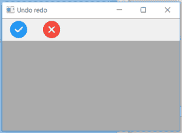
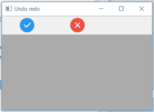

# wx xpython–wx 中的 SetTooPacking()函数。工具栏

> 原文:[https://www . geesforgeks . org/wxpython-settoopacking-function-in-wx-toolbar/](https://www.geeksforgeeks.org/wxpython-settoopacking-function-in-wx-toolbar/)

在本文中，我们将学习与 wx 相关联的函数 SetToolPacking()函数。wxPython 的工具栏类。函数的作用是:设置间距工具的值。默认值为 1。它只把包装作为一个参数。

> **语法:**
> 
> ```py
> wx.ToolBar.SetToolPacking(self, packing)
> 
> ```
> 
> **参数:**
> 
> | 参数 | 输入类型 | 描述 |
> | --- | --- | --- |
> | 包装 | （同 Internationalorganizations）国际组织 | 包装的价值。 |

**代码示例 1:**

```py
import wx

class Example(wx.Frame):

    def __init__(self, *args, **kwargs):
        super(Example, self).__init__(*args, **kwargs)
        self.InitUI()

    def InitUI(self):
        self.locale = wx.Locale(wx.LANGUAGE_ENGLISH)
        self.toolbar = self.CreateToolBar()

        td = self.toolbar.AddTool(1, 'right', wx.Bitmap('right.png'))
        te = self.toolbar.AddTool(2, 'wrong', wx.Bitmap('wrong.png'))

        # set packing of toolbar to 30
        self.toolbar.SetToolPacking(packing = 30)

        self.toolbar.Realize()
        self.Bind(wx.EVT_TOOL, self.OnOne, td)

        self.SetSize((350, 250))
        self.SetTitle('Undo redo')
        self.Centre()

    def OnOne(self, e):
        # Realize() called to finalize new added tools
        self.toolbar.Realize()

    def OnQuit(self, e):
        self.Close()

def main():

    app = wx.App()
    ex = Example(None)
    ex.Show()
    app.MainLoop()

if __name__ == '__main__':
    main()
```

**输出:**


**代码示例 2:**

```py
import wx

class Example(wx.Frame):

    def __init__(self, *args, **kwargs):
        super(Example, self).__init__(*args, **kwargs)
        self.InitUI()

    def InitUI(self):
        self.locale = wx.Locale(wx.LANGUAGE_ENGLISH)
        self.toolbar = self.CreateToolBar()

        td = self.toolbar.AddTool(1, 'right', wx.Bitmap('right.png'))
        te = self.toolbar.AddTool(2, 'wrong', wx.Bitmap('wrong.png'))

        # set packing of toolbar to 80
        self.toolbar.SetToolPacking(packing = 80)

        self.toolbar.Realize()
        self.Bind(wx.EVT_TOOL, self.OnOne, td)

        self.SetSize((350, 250))
        self.SetTitle('Undo redo')
        self.Centre()

    def OnOne(self, e):
        # Realize() called to finalize new added tools
        self.toolbar.Realize()

    def OnQuit(self, e):
        self.Close()

def main():

    app = wx.App()
    ex = Example(None)
    ex.Show()
    app.MainLoop()

if __name__ == '__main__':
    main()
```

**输出:**
