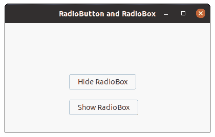
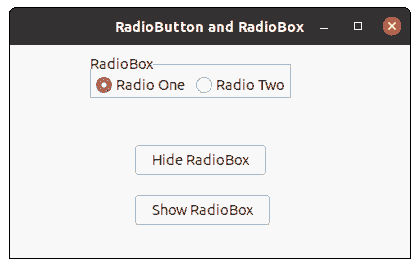

# wxPython–显示隐藏的无线电盒

> 原文:[https://www . geesforgeks . org/wxpython-show-hidden-radio-box/](https://www.geeksforgeeks.org/wxpython-show-hidden-radio-box/)

在本文中，我们将学习如何在框架中显示隐藏的无线电盒。为此，我们将使用 Show()方法。Show()方法可用于隐藏和显示小部件。
Show 采用布尔参数 Show，如果为 True，则显示小部件，否则隐藏它。

> **语法:** wx。无线电盒。显示(自我，显示=真)
> 
> **参数**
> 
> | 参数 | 输入类型 | 描述 |
> | --- | --- | --- |
> | 显示 | 弯曲件 | 如果为真，则显示小部件；如果为假，则隐藏小部件 |
> 
> **返回类型:** bool

**代码示例:**

```py
import wx

class FrameUI(wx.Frame):

    def __init__(self, parent, title):
        super(FrameUI, self).__init__(parent, title = title, size =(300, 200))

        # function for in-frame components
        self.InitUI()

    def InitUI(self):
        # parent panel for radio box
        pnl = wx.Panel(self)

        # list of choices
        lblList = ['Radio One', 'Radio Two']

        # create radio box containing above list
        self.rbox = wx.RadioBox(pnl, label ='RadioBox', pos =(80, 10), choices = lblList,
                                majorDimension = 1, style = wx.RA_SPECIFY_ROWS)

        # create a button in the frame
        self.btn = wx.Button(pnl, 1, "Hide RadioBox", pos =(125, 100));
        # create a button in the frame
        self.btn1 = wx.Button(pnl, 2, "Show RadioBox", pos =(125, 150));

        # bind a function with button btn
        self.btn.Bind(wx.EVT_BUTTON, self.onclick)
        # bind a function with button btn1
        self.btn1.Bind(wx.EVT_BUTTON, self.onclick1)

        # set frame in centre
        self.Centre()

        # set size of frame
        self.SetSize((400, 250))

        # show output frame
        self.Show(True)

    def onclick(self, e):
        # hide radio box from the frame
        self.rbox.Show(False)

    def onclick1(self, e):
        # shows radio box
        self.rbox.Show()

# wx App instance
ex = wx.App()
# Example instance
FrameUI(None, 'RadioButton and RadioBox')
ex.MainLoop()
```

**输出窗口:**


*前点击按钮*


*后点击按钮*