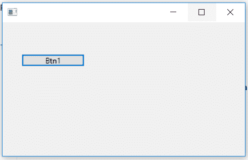
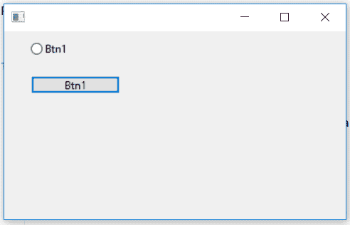

# wxPython–显示隐藏单选按钮

> 原文:[https://www . geesforgeks . org/wxpython-show-hidden-radio-button/](https://www.geeksforgeeks.org/wxpython-show-hidden-radio-button/)

在本文中，我们将学习如何显示隐藏的单选按钮。为了取消隐藏/显示单选按钮，我们可以使用 show()功能。Show()功能可以用来显示和隐藏单选按钮。函数的作用是:显示布尔参数，如果为真，显示窗口。否则，隐藏它。

> **语法:** wx。单选按钮。显示(自我，显示=真)
> 
> **参数:**
> 
> | 参数 | 输入类型 | 描述 |
> | --- | --- | --- |
> | 显示 | 弯曲件 | 如果为真，则显示窗口。否则，隐藏它。 |
> 
> **返回类型:** bool
> 
> **返回:**如果窗口已显示或隐藏，则为真；如果由于窗口已处于请求状态而未执行任何操作，则为假。

**代码示例:**

```py
import wx

APP_EXIT = 1

class Example(wx.Frame):

    def __init__(self, *args, **kwargs):
        super(Example, self).__init__(*args, **kwargs)

        self.InitUI()
    def InitUI(self):
        self.pnl = wx.Panel(self)

        # create radio button at position (30, 10)
        self.rb1 = wx.RadioButton(self.pnl, label ='Btn1', pos =(30, 10), size =(100, 20))

        # create button
        self.btn = wx.Button(self.pnl, label ='Btn1', 
                           pos =(30, 50), size =(100, 20))

        # hide radio button
        self.rb1.Hide()

        # bind event function
        self.btn.Bind(wx.EVT_BUTTON, self.Onclick)

    def Onclick(self, e):
            # show hidden radio button
            self.rb1.Show()

def main():
    app = wx.App()
    ex = Example(None)
    ex.Show()
    app.MainLoop()

if __name__ == '__main__':
    main()
```

**输出窗口:**

*点击进入按钮*前


*后点击按钮*