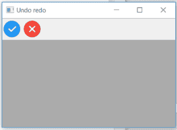
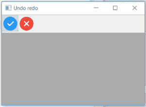

# wx 中的 wxPython–ToggleTool()函数。工具栏

> 原文:[https://www . geesforgeks . org/wxpython-toggletool-function-in-wx-toolbar/](https://www.geeksforgeeks.org/wxpython-toggletool-function-in-wx-toolbar/)

在本文中，我们将学习与 wx 相关联的 ToggleTool()函数。wxPython 的工具栏类。ToggleTool()函数用于打开或关闭工具。这不会导致发出任何事件。它需要两个参数，即 toolId 和 toggle。

> **语法:**
> 
> wx。工具栏。切换工具(自身、工具标识、切换)

**参数:**

<figure class="table">

| 参数 | 输入类型 | 描述 |
| --- | --- | --- |
| 椅子 | （同 Internationalorganizations）国际组织 | 传递给添加工具的有问题工具的标识。 |
| 触发器 | 弯曲件 | 如果为真，则打开工具，否则关闭工具。 |

</figure>

**代码示例 1:**

## 蟒蛇 3

```py
import wx

class Example(wx.Frame):

    def __init__(self, *args, **kwargs):
        super(Example, self).__init__(*args, **kwargs)
        self.InitUI()

    def InitUI(self):
        self.locale = wx.Locale(wx.LANGUAGE_ENGLISH)
        self.toolbar = self.CreateToolBar()

        td = self.toolbar.AddTool(1, 'right', wx.Bitmap('right.png'), kind = wx.ITEM_CHECK)
        te = self.toolbar.AddTool(2, 'wrong', wx.Bitmap('wrong.png'))
        self.toolbar.Realize()
        self.Bind(wx.EVT_TOOL, self.OnOne, td)

        self.SetSize((350, 250))
        self.SetTitle('Undo redo')
        self.Centre()

    def OnOne(self, e):
        # Toggle tool using ToggleTool() function
        self.toolbar.ToggleTool(toolId = 1, toggle = True)
        # Realize() called to finalize new added tools
        self.toolbar.Realize()

    def OnQuit(self, e):
        self.Close()

def main():

    app = wx.App()
    ex = Example(None)
    ex.Show()
    app.MainLoop()

if __name__ == '__main__':
    main()
```

**输出:**
*点击工具前:*



*点击工具后:*

