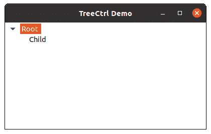

# wxppython tree ctrl

> 哎哎哎:# t0]https://www . geeksforgeeks . org/wx python-tree ctrl/

在本文中，我们将学习和 TreeCtrl，以及如何将 TreeCtrl 添加到我们的窗口中。树控件将信息呈现为一个层次结构，其中的项目可以展开以显示更多的项目。树控件中的项由 wx 引用。TreeItemId 句柄，可以通过调用 wx 来测试其有效性。TreeItemId.IsOk。

我们将使用 TreeCtrl()构造函数来创建 TreeCtrl。

> **语法:** wx。tree control . tree control(parent，id=ID_ANY，pos=DefaultPosition，size=DefaultSize，style=TR_DEFAULT_STYLE，validator=DefaultValidator，name=treectrlnamestr)
> 
> **参数**
> 
> | 参数 | 输入类型 | 描述 |
> | --- | --- | --- |
> | 父母 | wx。窗户 | 父窗口。不得为无。 |
> | 身份证明（identification） | wx.窗口标识 | 窗口标识符。值“标识 _ 任何”表示默认值。 |
> | 刷卡机 | wx。要点 | 窗口位置。如果 wx。如果指定了默认位置，则选择默认位置。 |
> | 大小 | wx。大小 | 窗口大小。如果 wx。如果指定了 DefaultSize，则窗口的大小会适当调整。 |
> | 风格 | 长的 | 窗口样式。 |
> | 验证器 | wx。验证器 | 窗口验证器 |
> | 名字 | 线 | 窗口名称 |

**代码示例:**

```py
import wx

class MainFrame(wx.Frame):

    def __init__(self):
        wx.Frame.__init__(self, parent = None, title ='TreeCtrl Demo')

        # tree control
        self.tree = wx.TreeCtrl(self, wx.ID_ANY, wx.DefaultPosition, wx.DefaultSize)

        # add root to tree
        self.root = self.tree.AddRoot('Root ')
        # add item to root
        self.tree.AppendItem(self.root, 'Child')
        # expand tree
        self.tree.Expand(self.root)

        # show frame
        self.Show()

if __name__ == '__main__':
    app = wx.App(redirect = False)
    frame = MainFrame()
    app.MainLoop()
```

**输出窗口:**
