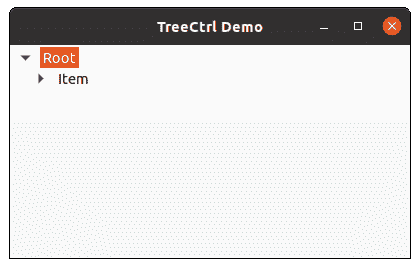

# wxPython–两步创建 wx。TreeCtrl

> 原文:[https://www . geesforgeks . org/wxpython-两步创建-wx-treectrl/](https://www.geeksforgeeks.org/wxpython-two-step-creation-wx-treectrl/)

在本文中，我们将学习如何使用两步创建来创建树控件。为此，我们将在 wx 中使用 Create()方法。TreeCtrl 类。基本上，我们将使用带有空参数的 TreeCtrl()构造函数初始化树控件，然后我们将使用 Create()方法和属性与树控件相关联。

> **语法:**
> 
> wx。TreeCtrl.Create(self，parent，id=ID_ANY，pos=DefaultPosition，size=DefaultSize，style=TR_DEFAULT_STYLE，validator=DefaultValidator，name=TreeCtrlNameStr)
> 
> **参数:**
> 
> <figure class="table">
> 
> | 参数 | 类型 | 描述 |
> | 父母 | wx。窗户 | 树控件的父窗口/框架。 |
> | 身份证明（identification） | wx.窗口标识 | 与树控件关联的小部件标识符 |
> | 刷卡机 | wx。要点 | 放置树控件的位置。 |
> | 大小 | wx。大小 | 树控件小部件的大小 |
> | 风格 | 长的 | 树控件的样式。 |
> | 验证器 | wx。验证器 | 与树控件关联的验证程序。 |
> | 名字 | 线 | 树控件的名称。 |
> 
> </figure>

**代码示例:**

## 计算机编程语言

```py
import wx

class TreePanel(wx.Panel):

    def __init__(self, parent):
        wx.Panel.__init__(self, parent)

        # initialize Tree Control
        self.tree = wx.TreeCtrl(self, wx.ID_ANY, wx.DefaultPosition, (100, 70),
                           wx.TR_HAS_BUTTONS)

        # create Tree Control using Create() method
        self.tree.Create
        # Add root to Tree Control
        self.root = self.tree.AddRoot('Root')

        # Add item to root
        itm = self.tree.AppendItem(self.root, 'Item')

        # Add item to 'itm'
        self.tree.AppendItem(itm, "Sub Item")

        # Expand whole tree
        self.tree.Expand(self.root)

        sizer = wx.BoxSizer(wx.VERTICAL)
        sizer.Add(self.tree, 0, wx.EXPAND)
        self.SetSizer(sizer)

class MainFrame(wx.Frame):

    def __init__(self):
        wx.Frame.__init__(self, parent = None, title ='TreeCtrl Demo')
        panel = TreePanel(self)
        self.Show()

if __name__ == '__main__':
    app = wx.App(redirect = False)
    frame = MainFrame()
    app.MainLoop()
```

**输出:**

