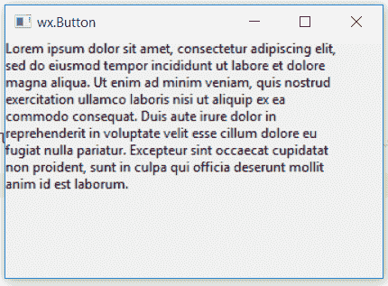

# wxPython–wx 中的 Wrap()函数。StaticText()

> 原文:[https://www . geesforgeks . org/wxpython-wrap-function-in-wx-static text/](https://www.geeksforgeeks.org/wxpython-wrap-function-in-wx-statictext/)

在本文中，我们将学习与 wx 相关联的 Wrap()函数。wxPython 的 StaticText 类。Wrap()函数包装控件标签，以便它的每一行都尽可能变得最宽像素宽(行在单词边界处断开，因此如果单词太长，情况可能不是这样)。

如果宽度为负，则不进行包装。请注意，该宽度不一定是控件的总宽度，因为可能会为边框添加几个像素(取决于控件的边框样式)。

> **语法:** wx。静态文本。换行(自身，宽度)
> 
> **参数:**
> 
> | 参数 | 输入类型 | 描述 |
> | --- | --- | --- |
> | 宽度 | （同 Internationalorganizations）国际组织 | 包装宽度。 |

**代码示例:**

```py
import wx

class Example(wx.Frame):

    def __init__(self, *args, **kwargs):
        super(Example, self).__init__(*args, **kwargs)
        self.InitUI()

    def InitUI(self):
        self.locale = wx.Locale(wx.LANGUAGE_ENGLISH)
        self.pnl = wx.Panel(self)

        bmp = wx.Bitmap('right.png')
        # CREATE STATICTEXT AT POINT (20, 20)
        self.st = wx.StaticText(self.pnl, id = 1, label ="Lorem ipsum ... laborum.", pos =(0, 0),
                                 size = wx.DefaultSize, style = 0, name ="statictext")

        # WRAP TEXT IN A PARTICULAR WIDTH
        self.st.Wrap(300)

        self.SetSize((350, 250))
        self.SetTitle('wx.Button')
        self.Centre()

def main():
    app = wx.App()
    ex = Example(None)
    ex.Show()
    app.MainLoop()

if __name__ == '__main__':
    main()
```

**输出窗口:**
